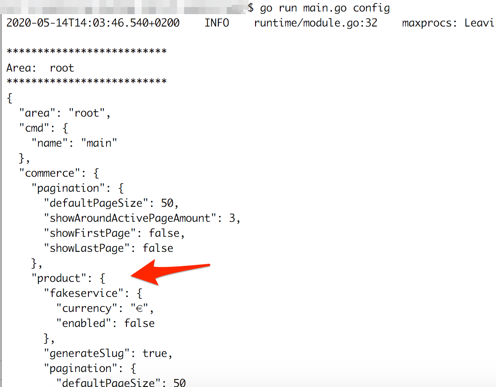
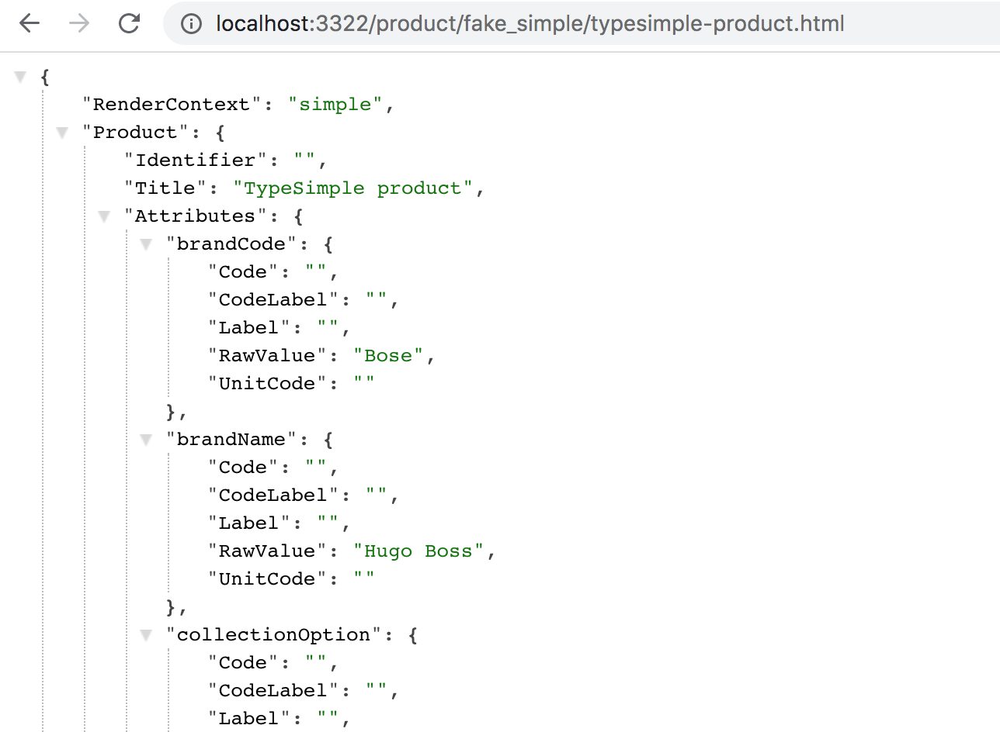
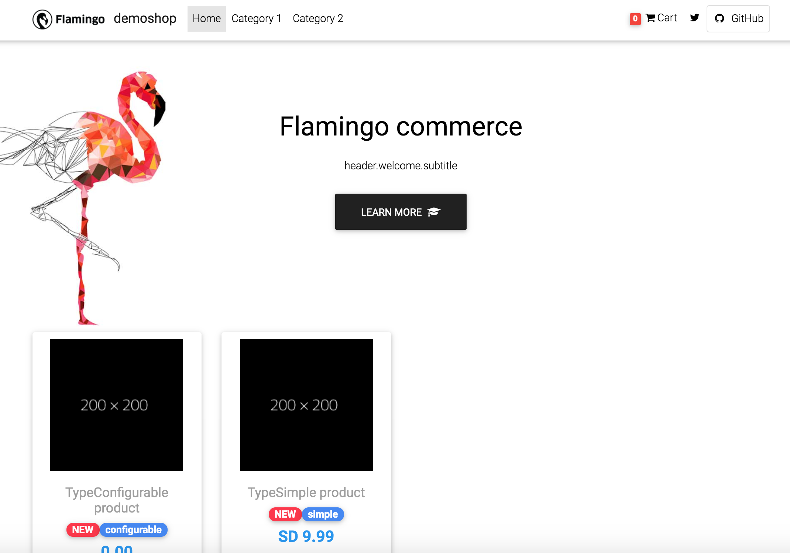
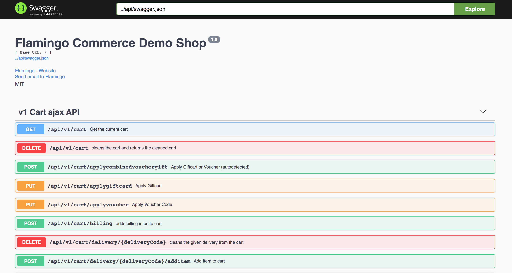
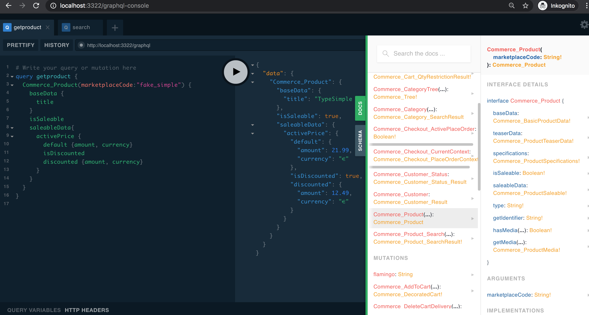

# Start

# About Flamingo Commerce
Flamingo Commerce is an e-commerce framework written in go.
It includes a set of modules that allows you to build flexible e-commerce portals.
The architecture of Flamingo Commerce works well with so called "headless" ecommerce APIs or microservice oriented architectures.
This is because you can implement various adapters to use the e-commerce features together with existing services or APIs.
Flamingo Commerce is build on top of Flamingo (a web framework based on Go).

# About this article
In this post you will learn how you can use Flamingo Commerce to build an e-commerce Webshop.

We will start step by step with an empty project - and we will end up with a complete workable shop - including a HTML view and a full featured graphQL API and Rest API.

You will also learn on an example how individual adapters can be used to connect the webshop to any data sources: In this case we will load products from a CSV file

# 1. Start a "myshop" project with products

Lets start with creating an empty go project:

```shell
mkdir myshop
cd myshop
go mod init myshop
go get -v flamingo.me/flamingo-commerce/v3
```
This created a new go module "myshop" and added "flamingo-commerce" as an dependency. 
You can check this by opening the `go.mod` file inside your project.

We will then kickstart the application and we will start by using the product module.
Therefore create a file `main.go` inside your project with the following content:

```go
package main

import (
	"flamingo.me/dingo"
	"flamingo.me/flamingo/v3"
	"flamingo.me/flamingo-commerce/v3/product"
)

func main() {
	flamingo.App([]dingo.Module{
		new(product.Module),
	})
}
```
This 3 lines inside the main func will initialize a Flamingo application with the product module.
When starting your project the Flamingo default bootstrap will start.

Lets try this and run the application:

`go run main.go`

You will see the list of available commands. You can run 

`go run main.go config`  to see the active default configuration of your project.




We will learn more about the configuration later.
But for now lets try to run the application by:
`go run main.go serve`

You will see the following error `can not instantiate interface flamingo.me/flamingo-commerce/v3/product/domain.ProductService` together with a stack trace.

That means that there is no ProductService registered yet. The ProductService is a so called Adapter that the product module needs in order to get products.
For now we will enable the provided "FakeProductService" that just provides some dummy products.

We will do this with setting the feature flag via configuration.
Please create a config file in the path "config/config.yml":

```shell script
mkdir config
cat config/config.yml
```

With the following content:
```yaml
flamingo.session.cookie.secure: false

commerce:
  product:
    fakeservice:
      enabled: true
```
The first line disables the session cookie secure mode - this is required for local testing. 
The rest configures the Flamingo Commerce product module and enables a dummy adapter that provides two fake products for testing purposes.

You can now successfully start the application and try that out:

```shell script
go run main.go serve
```

and open the url for a product single view:

* http://localhost:3322/product/fake_simple/typesimple-product.html
* http://localhost:3322/product/fake_configurable/typeconfigurable-product.html



What you see is the plain data for a product single page.
Because we have no template engine configured, Flamingo will just output the data as JSON. (We will configure templates in step 3 of this tutorial)

By the way the products module also offers a Rest API to access product data:

* http://localhost:3322/api/v1/products/fake_configurable

## 2. Add more commerce functionality
Now we want to add more Flamingo Commerce features. So we are going to include the following modules:

* cart: Provides features to deal with a cart (supporting multiple deliveries)
* category: Provides features to browse in a category tree
* checkout: Provides a basic checkout controller with a typical flow

Therefore edit again your project `main.go` file and add the missing modules to the Bootstrap like this:

```go
package main

import (
	"flamingo.me/dingo"
	"flamingo.me/flamingo-commerce/v3/cart"
	"flamingo.me/flamingo-commerce/v3/category"
	"flamingo.me/flamingo-commerce/v3/checkout"
	"flamingo.me/flamingo/v3"
	"flamingo.me/flamingo-commerce/v3/product"
)

func main() {
	flamingo.App([]dingo.Module{
		new(product.Module),
		new(cart.Module),
		new(category.Module),
		new(checkout.Module),
	})
}

```

Like the product module also the other module provides several "ports" where adapters can be registered.
The registered adapters are responsible for implementing the detail functionality of the modules: 
For example there can be adapters for the cart module, that work with the Magento Cart API or the shopify API.

For this example we are using the simple adapters that are included in the Flamingo Commerce packages (they are activated by configuration).
So before we can use the newly added commerce modules, we need to configure the required adapters. 
Therefore add the following configuration to your `config.config.yml`

```yaml
flamingo.session.cookie.secure: false

commerce:
  product:
    fakeservice:
      enabled: true
  cart:
    emailAdapter:
      # The email where place order infos are send to:
      emailAddress: lkklj@lkjkj.de
  customer:
    # Activate the nil customer adapter (that returns no infos about a logged in user :-))
    useNilCustomerAdapter: true
  category:
    # Activate a simple category adapter that just returns the configured tree
    useCategoryFixedAdapter: true
    categoryServiceFixed:
      tree:
        category1:
          code: category1
          name: Category 1
        category2:
          code: category2
          name: Category 2
  payment:
    # Include the basic payment gateway adapter that provides "offline" payment methods
    enableOfflinePaymentGateway: true
```

The cart module also uses the Flamingo oauth module - because it supports stored customer carts and placing orders for authenticated customers.
If you like you can already add the configuration for an openid (oauth2) provider like this (but it is not required):
```yaml
core:
  oauth:
    server: "https://accounts.google.com"
    clientid: "xxxxxxxxxx.apps.googleusercontent.com"
    secret: "xxxxxx"
```
You can find more infos on [how to use google as openid-connect provider here.](https://developers.google.com/identity/protocols/oauth2/openid-connect)

You can check all the registered routes on the command line by calling `go run main.go routes`.

At this stage you could already use the Ajax Rest APIs and for example work with the cart from a browser application.

However in the next step we will add a real template and we can see the shop in action.


## 3. Add templates

Now we are going to add real templates that render the HTML version of the shop.
Therefore we will use the [pugtemplate](https://docs.flamingo.me/3.%20Flamingo%20Modules/3.%20pugtemplate.html) module and we will use the demoshop templates:

Add the pugtemplate module to the project by typing the following to the shell:
```shell script
go get flamingo.me/pugtemplate
```

and then add the module to the Flamingo application by editing your `main.go` file:
```
package main

import (
	"flamingo.me/dingo"
	"flamingo.me/flamingo-commerce/v3/cart"
	"flamingo.me/flamingo-commerce/v3/category"
	"flamingo.me/flamingo-commerce/v3/checkout"
	"flamingo.me/flamingo/v3"
	"flamingo.me/pugtemplate"
	"flamingo.me/flamingo-commerce/v3/product"
)

func main() {
	flamingo.App([]dingo.Module{
		new(product.Module),
		new(cart.Module),
		new(category.Module),
		new(checkout.Module),
		new(pugtemplate.Module),
	})
}

```


Now we will [download a demo template set](https://github.com/i-love-flamingo/commerce-demo-carotene/releases/download/frontend.v1/frontend.zip) :

```shell script
wget https://github.com/i-love-flamingo/commerce-demo-carotene/releases/download/frontend.v1/frontend.zip
unzip frontend.zip
```

This demo templates do also include a home page - we should add a route in our project for this. 
Therefore create a file `config/routes.yml`

```
- path: /
  name: index
  controller: flamingo.render(tpl="home/home")

- path: /offers
  name: index
  controller: flamingo.render(tpl="offers/offers")
```

If you run the application again with `go run main.go serve`  and open `http://localhost:3322/` you should see a nice homepage with the two test products:



## 4. Work with the APIs
### 4.1. Enable open-api (akka swagger) console
Most of the modules already offer routes for Rest style APIs that can be used through Ajax for example.

To offer a nice api console you have to generate a swagger file.
Therefore add the "swagger" module to your project:

```shell script
go get -v flamingo.me/swagger
```

And add the module - together with the meta description of your api lines to your main.go file.
It should look like this then:

```go
package main

import (
	"flamingo.me/dingo"
	"flamingo.me/flamingo-commerce/v3/cart"
	"flamingo.me/flamingo-commerce/v3/category"
	"flamingo.me/flamingo-commerce/v3/checkout"
	"flamingo.me/flamingo/v3"
	"flamingo.me/pugtemplate"
	"flamingo.me/flamingo-commerce/v3/product"
	"flamingo.me/swagger"
)

//go:generate go run github.com/swaggo/swag/cmd/swag init --parseDependency=1 --generalInfo=main.go

// @title Flamingo Commerce Demo Shop
// @version 1.0
// @BasePath /
// @license.name MIT
// @contact.name Flamingo
// @contact.url https://gitter.im/i-love-flamingo/community#
// @contact.email flamingo@aoe.com
func main() {
	flamingo.App([]dingo.Module{
		new(product.Module),
		new(cart.Module),
		new(category.Module),
		new(checkout.Module),
		new(pugtemplate.Module),
		new(swagger.Module),
	})
}
```

Then generate the swagger file by typing `go generate`. (It might take a while because all dependencies are downloaded and scanned in the background)
When the command finished you should a swagger file generated in the folder `docs`.
Start your application again with `go run main.go serve` and open http://localhost:3322/api-console/

You should see the swagger api console:


### 4.2. GraphQL API
Add the Flamingo graphql module to your project - the same way we did with the swagger module: `go get -v flamingo.me/graphql`
And add it to your `main.go`
```go
...
import (
    ...
    "flamingo.me/graphql"
    ...
)
...
func main() {
	...
		new(graphql.Module),
	...
}
...
```
The graphql module provides a new flamingo command that generates the projects graphql resolver.
This is necessary because the overall graphql schema depends on all the modules that are loaded in your project.

Run this command:

```
go run -tags graphql main.go graphql
```
After the command is ready you have your projects root graphql resolver and schema generated in the folder "graphql".
This module need to be included in your project - so again edit your `main.go` file:

```go
package main

import (
	"flamingo.me/dingo"
	"flamingo.me/flamingo-commerce/v3/cart"
	"flamingo.me/flamingo-commerce/v3/category"
	"flamingo.me/flamingo-commerce/v3/checkout"
	"flamingo.me/flamingo/v3"
	"flamingo.me/pugtemplate"
	"flamingo.me/flamingo-commerce/v3/product"
	"flamingo.me/swagger"
	"flamingo.me/graphql"
	projectGraphql "myshop/graphql"
)

//go:generate rm -f graphql/generated.go
//go:generate go run -tags graphql main.go graphql

//go:generate go run github.com/swaggo/swag/cmd/swag init --parseDependency=1 --generalInfo=main.go

// @title Flamingo Commerce Demo Shop
// @version 1.0
// @BasePath /
// @license.name MIT
// @contact.name Flamingo
// @contact.url https://gitter.im/i-love-flamingo/community#
// @contact.email flamingo@aoe.com
func main() {
	flamingo.App([]dingo.Module{
		new(product.Module),
		new(cart.Module),
		new(category.Module),
		new(checkout.Module),
		new(pugtemplate.Module),
		new(swagger.Module),
		new(graphql.Module),
		new(projectGraphql.Module),
	})
}
```

If you try to run the project you will see the following error: 
```shell script
graphql/resolver.go:26:10: cannot use r.queryResolver (type *queryResolver) as type QueryResolver in return argument
```

This is because the generated module does not yet have a proper resolver implementation to resolve the generated overall schema.
We going to fix this by adding the required Flamingo Commerce graphql resolver to our root resolver.

Open the file `graphql/resolver.go` and search for the generated `queryResolver` and `mutationResolver` struct types.
Here we need to embed the required Flamingo Commerce resolvers. The relevant parts should then look like this:

```go
...
import (
	graphql2 "flamingo.me/flamingo-commerce/v3/cart/interfaces/graphql"
	graphql3 "flamingo.me/flamingo-commerce/v3/category/interfaces/graphql"
	graphql4 "flamingo.me/flamingo-commerce/v3/checkout/interfaces/graphql"
	graphql5 "flamingo.me/flamingo-commerce/v3/customer/interfaces/graphql"
	graphql6 "flamingo.me/flamingo-commerce/v3/product/interfaces/graphql"
	"flamingo.me/graphql"
)
...
type queryResolver struct {
	*graphql.FlamingoQueryResolver
	*graphql2.CommerceCartQueryResolver `inject:""`
	*graphql3.CommerceCategoryQueryResolver `inject:""`
	*graphql4.CommerceCheckoutQueryResolver `inject:""`
	*graphql5.CustomerResolver `inject:""`
	*graphql6.CommerceProductQueryResolver `inject:""`
}
...

type mutationResolver struct {
	*graphql.FlamingoQueryResolver
	*graphql2.CommerceCartMutationResolver `inject:""`
	*graphql4.CommerceCheckoutMutationResolver `inject:""`
}
...
```

In order to activate the graphql console with schema browsing we need to activate it in the configuration.
Edit your `config.config.yml` and add the following line:

```yaml
graphql:
  introspectionEnabled: true
```


If you now open http://localhost:3322/graphql-console/ you should see the graphql console:



There are many query and mutations to discover. Lets try to place an order through graphQL:
```graphql
mutation {
  Commerce_AddToCart(marketplaceCode: "fake_simple", qty: 1, deliveryCode: "delivery") {
    cart {
      id
      deliveries {
        cartitems {
          id
          productName
        }
      }
    }
  }
}
```
Then we at least need to set the desired payment method:
```graphql
mutation addpayment {
  Commerce_Cart_UpdateSelectedPayment(gateway: "offline", method:"offlinepayment_cashondelivery") {
    processed
  }
} 
```
And start the place order process:
```graphql
mutation placeorder {
  Commerce_Checkout_StartPlaceOrder(returnUrl:"") {uuid}
}
```
The place order process is designed as an background process and Flamingo Commmerce ensures that there is only one active place order process.
Since a payment method might require external redirects you can always check for the current status of the active place order process:

```graphql

query placeordercontext { 
  Commerce_Checkout_CurrentContext{
    state {
      name
      __typename
      ... on Commerce_Checkout_PlaceOrderState_State_Failed {name reason {reason}}      
    }
    orderInfos {
      paymentInfos {amount{amount currency}}
      email
      placedOrderInfos {orderNumber}
    }
    uuid
    
  }
}
```

Since in our case no payment redirect is required, you will see the place order process in the state "Commerce_Checkout_PlaceOrderState_State_Success" and you will see the order number.

If that worked for you until here: Congratulations - we sucessfully placed an order through the graphQL API of Flamingo Commerce. 
You can use the very same APIs from a single page application or any other client.


## 5. Load products from CSV
 
...

